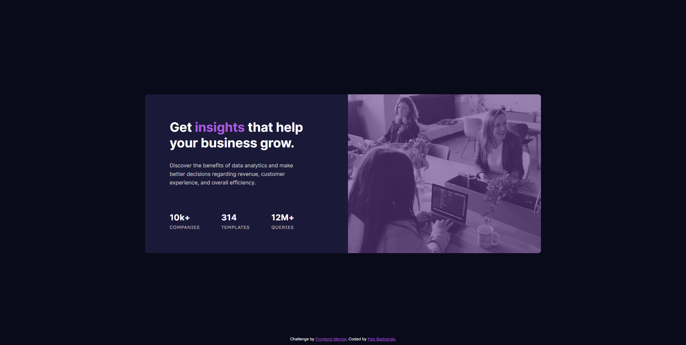

# Frontend Mentor - Stats preview card component

## Welcome! 👋

Thanks for checking out this front-end coding challenge.

**To do this challenge, I needed a basic understanding of HTML and CSS.**

## The challenge

My challenge was to build out this card component and get it looking as close to the design as possible.

This is my solution:

This is my mobile view solution:

